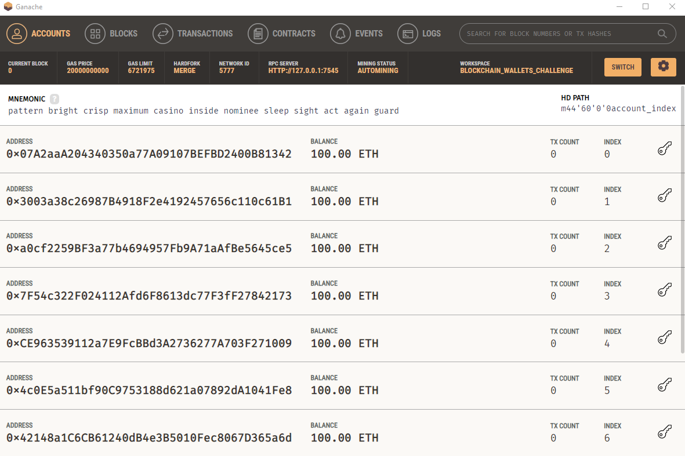
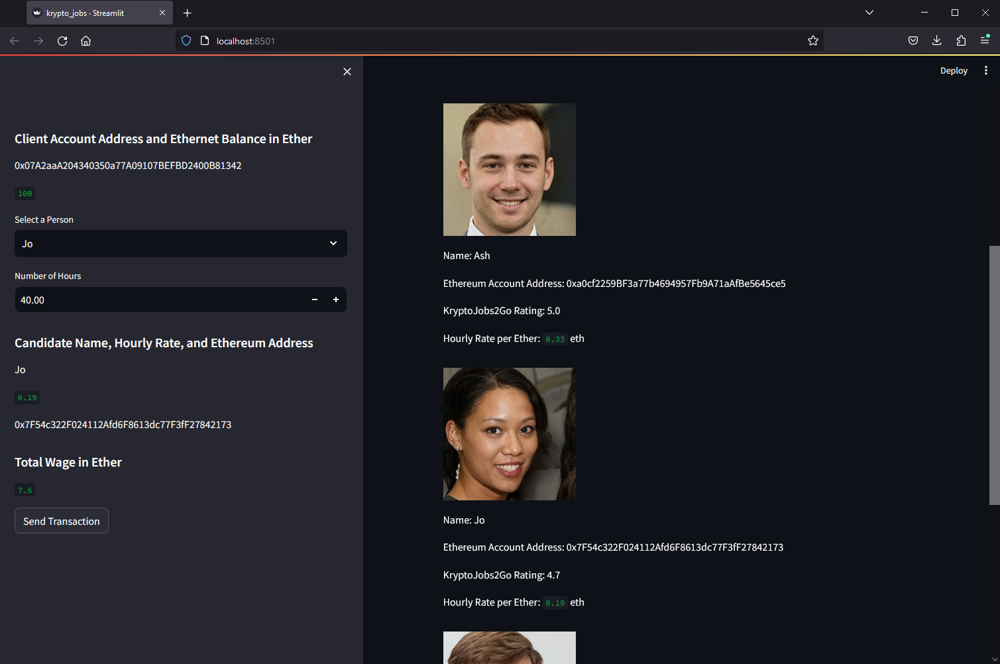
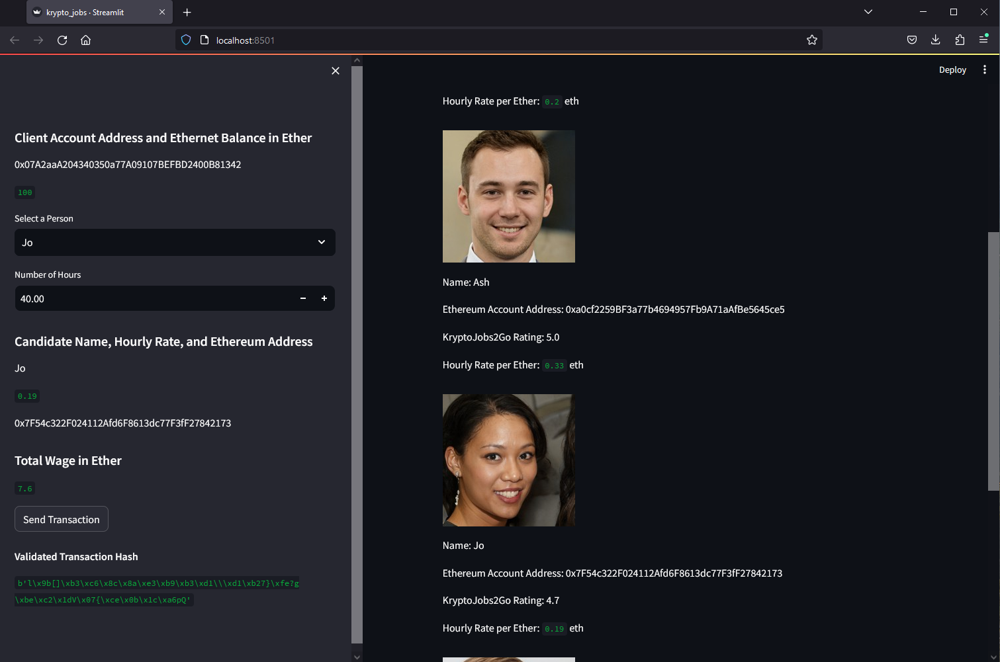
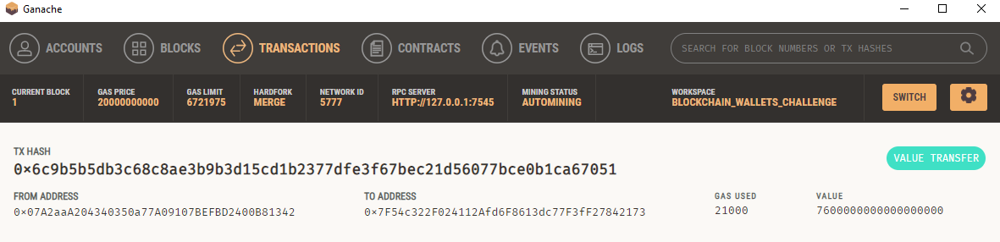
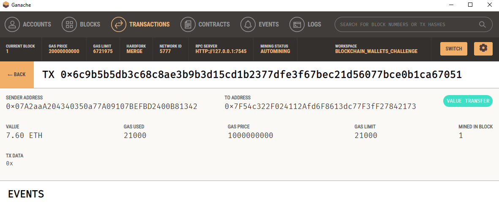
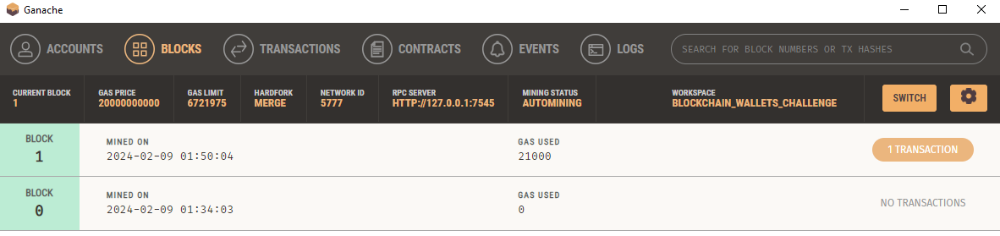
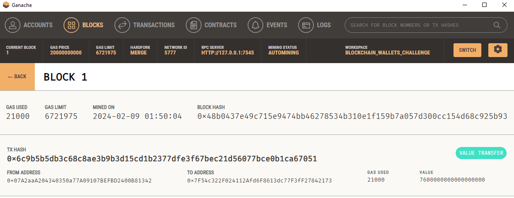

# Fintech Bootcamp - Blockchain Wallets Challenge

## Summary

This repository contains the files for the module 19 homework assignment: blockchain wallets challenge.

## File description

### Primary Code

All of the primary code can be found in the Python files named "krypto_jobs.py" and "crypto_wallet.py", which are located in this folder.  "krypto_jobs.py" contains the streamlit code for the data application and "crypto_wallet.py" contains functions used by the "krypto_jobs.py" code.

### Stock Images

All of the stock images (provided by the starter code) showing the four fintech professionals can be found in the Images folder:

- ash.jpeg
- jo.jpeg
- kendall.jpeg
- lane.jpeg

## Streamlit Application Example

All of the images showing the performance of the web application can be found in the Application_Images folder.

To demonstrate the functionality of the Streamlit application, consider the following example.  Ganache was initially set up with 10 accounts, each having 100 eth.  Note that the mnemonic is not secure, and that all of the accounts and their respective amounts are fictional.

The first account (index 0) belongs to the user, which in this case is me.  The second through fifth accounts belong to Lane, Ash, Jo, and Kendall at indices 1-4, respectively.  As a part of this exercise, I will send 40 hours' worth of eth to Jo at their hourly rate (0.19 eth) for a total of 7.6 eth transferred.

The Streamlit application looks like this:

In the image, you can see the client account address, which matches the address at index 0 in the Ganache workspace.  You can also see Jo's account address, which matches the address at index 3 in the Ganache workspace.  Once the "Send Transaction" button is clicked, it produced a valid hash, which is displayed in the lower left:

In Ganache, the approriate accounts now have updated balances, reflecting that 7.60 eth was transferred from the user's account to Jo's account:

The transaction history shows the transaction details:

Finally, Ganache also shows that the transaction took place on Block 1 of the chain:

